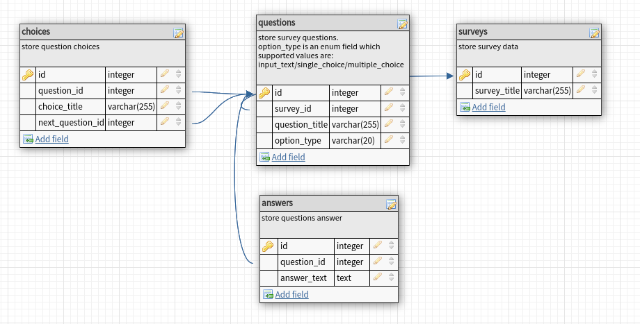

## Survey Management Project

### setup guidelines

#### Prerequisites:
* need to be installed [docker](https://docs.docker.com/install/) and [docker-compose](https://docs.docker.com/compose/install/) in your pc

### clone project
1. git clone `https://github.com/ratoncse24/ror-survey-management.git`
2. cd `ror-survey-management`

### run project
#### using pre-build docker hub images from hub.docker.com
1. `docker-compose -f hub.docker-compose.yml up -d`
## or
#### using local Dockerfile
1. `docker-compose up -d`

### access project
* frontend application url: `http://localhost:3002`
* backend API application  url: `http://localhost:3000`

#### run Rspec test
1. open terminal
2. run: `docker exec -it survey-backend bash -c "RAILS_ENV=test bundle exec rspec"`

#### database design

